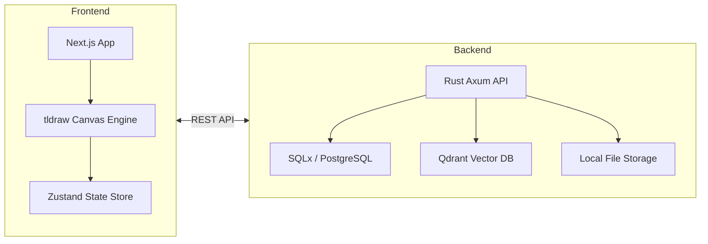

# 🌌 InfiniteBase

[](https://github.com/DerJanniku/InfiniteBase/actions/workflows/ci.yml)
[](LICENSE)
[](docs/ROADMAP.md)
[](docs/ARCHITECTURE.md)

**A spatial, local-first infinite canvas workspace and visual knowledge operating system.**

InfiniteBase redefines how we interact with digital information. By replacing rigid, context-poor folder hierarchies with a spatial, node-based infinite canvas, it provides a fluid environment for school, professional work, and personal knowledge management.

---

## 🏗 High-Level Architecture

InfiniteBase is built for performance and scale, utilizing a decoupled full-stack architecture with a focus on data integrity and low-latency interaction.



### Key Technical Pillars:
- **Reactive Frontend:** Leveraging **tldraw** for high-performance vector rendering and **Zustand** for lightweight, atomic state management.
- **Robust Backend:** A high-concurrency **Rust** service using **Axum** for safe, type-checked API routing and **SQLx** for compile-time verified database queries.
- **Semantic Search:** Integrated **Qdrant** vector database to enable future AI-powered contextual discovery and automated node linking.

---

## ✨ Features

- **🚀 Spatial Organization:** Organize files, notes, and links as interactive nodes on an endless canvas.
- **📁 File-Native Nodes:** Seamlessly upload and preview documents directly within your workspace.
- **🔒 Privacy-First:** Designed for local-first operation. Your data stays under your control.
- **🤖 Agent-Ready API:** Extensible API surface designed for "Bring Your Own Agent" (BYOA) automation.
- **🚮 Visual Trash Model:** Sophisticated soft-delete behavior ensuring you never lose context by accident.

---

## 🛠 Tech Stack

| Layer | Technologies |
|---|---|
| **Frontend** | Next.js 15, React 19, TypeScript, tldraw, TailwindCSS 4, Zustand |
| **Backend** | Rust, Axum, SQLx, Tokio, Tower-HTTP |
| **Data** | PostgreSQL (Relational), Qdrant (Vector), Local FS |
| **Ops** | Docker, GitHub Actions (CI/CD) |

---

## 🚀 Getting Started

### Prerequisites
- **Docker** & **Docker Compose**
- **Node.js 22+** (for frontend development)
- **Rust 1.80+** (for backend development)

### One-Command Launch
```bash
# Clone and start the full environment
git clone https://github.com/DerJanniku/InfiniteBase.git
cd InfiniteBase
docker compose up --build
```

### Service Endpoints
- **Frontend UI:** `http://localhost:3000`
- **Backend API:** `http://localhost:8080`
- **Qdrant Dashboard:** `http://localhost:6333`

---

## 🤝 Collaboration & Standards

We maintain high engineering standards to ensure long-term maintainability.

- **Rust:** Idiomatic code with strict Clippy linting.
- **TypeScript:** Type-safe development with 100% coverage on new components.
- **Git:** Conventional commit messages (`feat:`, `fix:`, `chore:`, `docs:`).

Interested in contributing? Please check out our [Contributing Guide](docs/CONTRIBUTING.md).

---

<p align="center">
  <b>Architected and developed with ❤️ by DerJanniku</b><br>
  <i>Focusing on spatial computing, privacy, and automated intelligence.</i>
</p>
